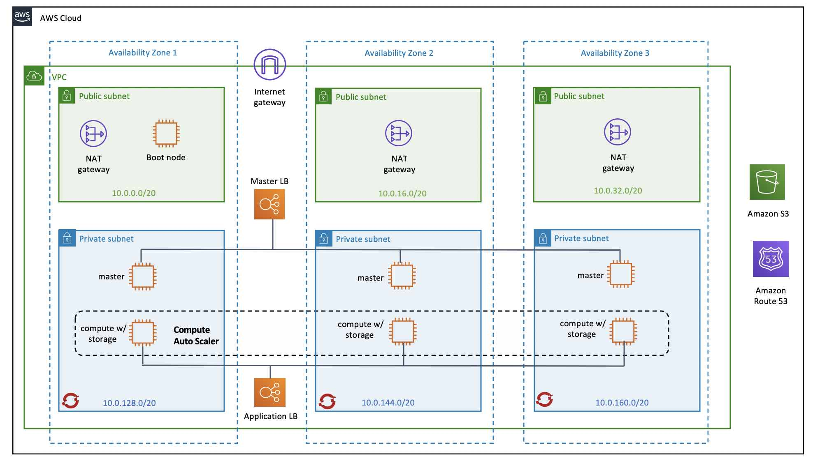

# Cloud Pak for Data 3.0 on AWS

## Deployment Topology

Deploying this template builds the following Cloud Pak for Data cluster in single zone or multi zone.



The deployment sets up the following as shown in the diagram.
 - A highly available architecture that spans one or three Availability Zones.
 - A VPC configured with public and private subnets according to AWS best practices, to provide you with your own virtual network on AWS.
 - In the public subnets:
   - Managed network address translation (NAT) gateways to allow outbound internet access for resources in the private subnets.
   - A bootstrap server Amazon Elastic Compute Cloud (Amazon EC2) instance that also serves as a bastion host to allow inbound Secure Shell (SSH) access to EC2 instances in private subnets.
 - In the private subnets:
   - OCP master instances up to three Availability Zones
   - OpenShift Container Platform (OCP) compute nodes.
   - Elastic Block Storage disks that are mounted on the compute nodes for container persistent data.
 - A Classic Load Balancer spanning the public subnets for accessing Cloud Pak for Data from a web browser. Internet traffic to this load balancer is only permitted from ContainerAccessCIDR.
 - A Network Load Balancer spanning the public subnets for accessing the OCP master instances. Internet traffic to this load balancer is only permitted from RemoteAccessCIDR.
 - A Network Load Balancer spanning the private subnets for routing internal OpenShift application programming interface (API) traffic to the OCP master instances.
 - Amazon Route 53 as your public Domain Name System (DNS) for resolving domain names of the IBM Cloud Pak for Data management console and applications deployed on the cluster.


### Steps to Deploy

* Create a Route 53 domain.
* [Download](https://cloud.redhat.com/openshift/install/pull-secret) a pull secret. Create a Red Hat account if you do not have one.
* [Sign up](https://www.ibm.com/account/reg/us-en/signup?formid=urx-42212) for a Cloud Pak for Data Trial Key if you don't have the entitlement API key.
* If you choose Portworx as your storage class, see [Portworx documentation](PORTWORX.md) for generating `portworx spec url`.
* If you choose OCS as your storage class, make sure your region supports `m4.4xlarge` instance type. 
* Edit `variables.tf` and provide values for all the configuration variables. See the [Variables documentation](VARIABLES.md) for more details.
* Read the license at https://ibm.biz/BdqyB2 and accept it by setting variable `accept-cpd-license` to `accept`.
* If you want to hide sensitive data such as access_key_id or secret_access_key, remove the `default     = " " ` from `variables.tf` file against that variable.
```
Example:

variable "access_key_id" {
}
```
* Create file `osaws_var.tfvars` and write all the sensitive variables for which no `default     = " " ` value is provided in `variables.tf` file.
```
Example:

cat osaws_var.tfvars

access_key_id = "xxxxxxxxxxxxxxxxxxxxxxx"
secret_access_key = "xxxxxxxxxxxxxxxxxxxxxxx"
pull-secret-file-path = "xxxxxxxxxxxxxxxxxxxxxxx"
public_key_path = "xxxxxxxxxxxxxxxxxxxxxxx"
ssh-private-key-file-path = "xxxxxxxxxxxxxxxxxxxxxxx"
dnszone = "xxxxxxxxxxxxxxxxxxxxxxx"
entitlementkey = "xxxxxxxxxxxxxxxxxxxxxxx"
ssh-public-key = "xxxxxxxxxxxxxxxxxxxxxxx"
```
* Change the current directory to aws_infra:
```
cd cpd_terraform-master/aws/aws_infra
```
* Deploy scripts by executing the following command from the `cpd_terraform-master/aws/aws_infra` directory:
```bash
terraform init
terraform apply -var-file="Path To osaws_var.tfvars file"
```


### Destroying the cluster
* Run:
  ```bash
  terraform destroy -target null_resource.destroy_cluster -var-file="Path To osaws_var.tfvars file"
  terraform destroy -var-file="Path To osaws_var.tfvars file"
  ```
