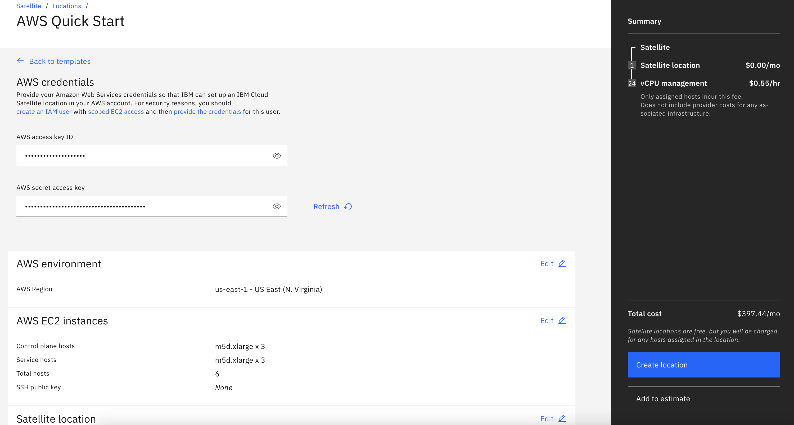
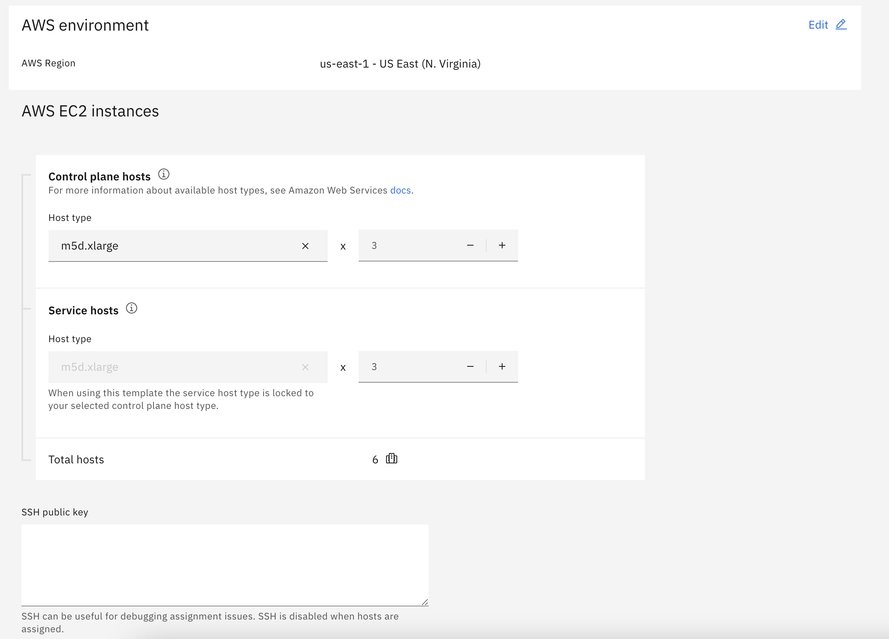
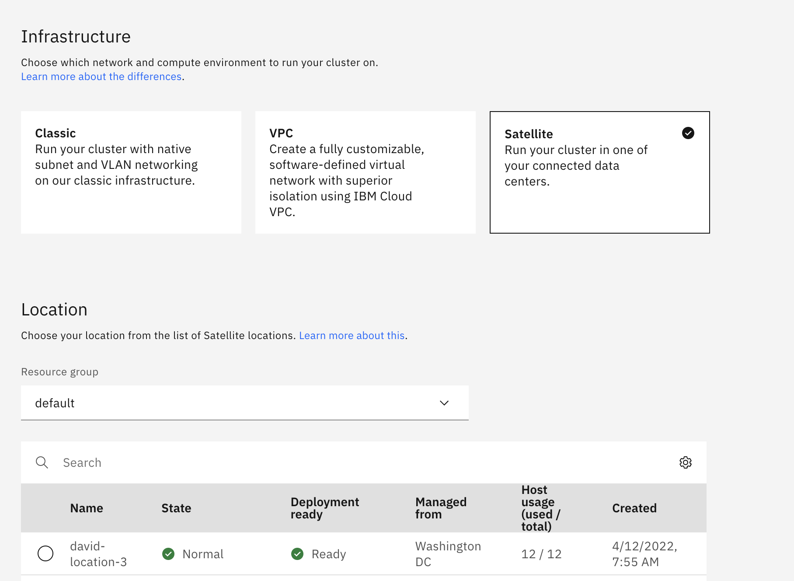
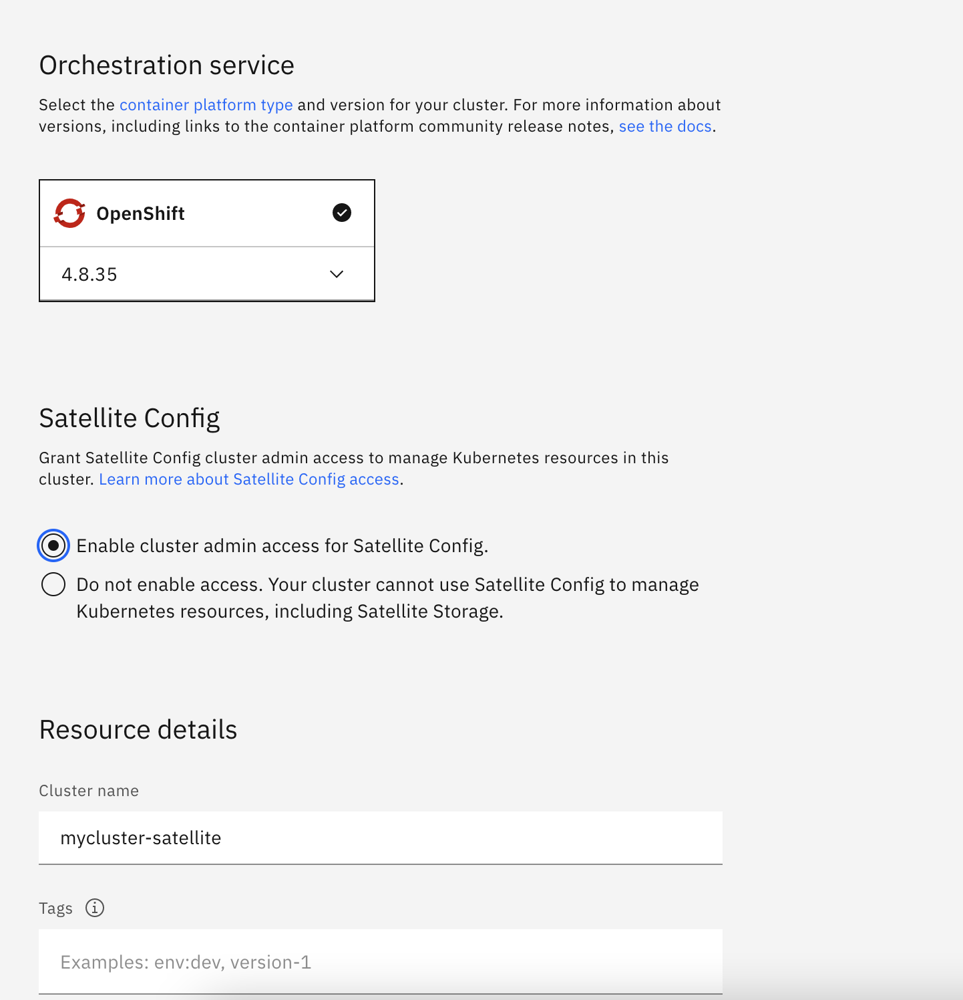

  

# Cloud Pak for Data on IBM Cloud Satellite locations using AWS Infrastructure

  This guide provides step-by-step instructions to install Cloud Pak for Data at IBM Cloud Satellite location using Amazon Web Services (AWS) Infrastructure.  The Red Hat® OpenShift® cluster deployed here uses Red Hat® OpenShift® Data Foundation—previously Red Hat OpenShift Container Storage—which is a software-defined storage for containers.

In order to deliver consistent experience across various form factors including Satellite locations, following capabilities have been certified by Cloud Pak for Data team on Cloud Pak for Data clusters deployed on IBM Cloud Satellite locations using AWS Infrastructure and ODF storage.

-   WKC
-   Watson Studio
-   Watson Query i.e Data Virtualization
-   Datastage
-   Db2
-   Db2 Warehouse
-   Cognos Analytics
-   Match 360 
-   Planning Analytics
-   Watson Discovery
-   Watson Assistant
  
  ## Steps to Deploy
  
  The following  are the steps to be followed to deploy 
  
1. [Creating a Satellite location in IBM Cloud using AWS infrastructure](#step-1-creating-a-satellite-location-in-ibm-cloud-using-aws-infrastructure)
2. [Create an OpenShift cluster at the location](#step-2-create-an-openshift-cluster-at-the-satellite-location)
3. [Configure storage](step-3-configure-storage)
4. [Install Cloud Pak for Data](step-4-install-cloud-pak-for-data)


## Prerequisites

Before you begin this process, you will need the following information:

- AWS Access key and secret ( AdministratorAccess policy is required for the IAM user who will be used for deploying the cluster.)

- Size of nodes to provision (CPU and RAM) (Minimum 16core\*64GB each node - md5.4xlarge)

- Every time we create satellite cluster by default 3 nodes are assigned to control plane and remaining will be worker nodes (minimum 3 worker nodes). Please refer to [Cloud Pak for data hardware requirements](https://www.ibm.com/docs/en/SSQNUZ_4.0/sys-reqs/hardware-reqs.html) to determine the number of master and worker nodes needed for the cluster.  Please ensure that you provision 3 additional nodes than the hardware requirements specified by the Cloud Pak for data requirements, as 3 nodes will be assigned to the IBM Cloud Satellite control plane.


## Step 1: Creating a Satellite location in IBM Cloud using AWS infrastructure


1. After logging on to [IBM Cloud](https://cloud.ibm.com/), from Menu, Select **Satellite** > **Locations** > **Create location**

When you select the **Amazon Web Services template** you will need to provide your AWS **access key ID** and **secret access key**.

  


  



  

**Size of nodes to provision (CPU and RAM)**

  

The minimum requirement is 16 CPU X 64GB memory for each worker node on a Cloud Pak for Data cluster.  So your EC2 instances should be configured in such a way to offer mentioned configuration. (for example m5d.4xlarge 16 cpu x 64GB)

  



  

**Note**: You do not need to create Object storage as we will configure storage later.

  

After you click Create, the EC2 Instances are provisioned for you on AWS. This can take a while and you’ll know the hosts are ready when the Satellite Location status is Normal. For reference you can always check the logs in workspace. ( Schematics -> Workspaces). 

  
 

## Step 2: Create an OpenShift cluster at the satellite location

In the **Satellite > Cluster** page select **Create Cluster** then select **Satellite** as your infrastructure and then select your **Satellite Location**.



  

Under Worker Pools, you also need to select the size of the nodes for your cluster and which zone they reside in.When the cluster is provisioned, it will use the number of nodes you specified from each selected zone as worker nodes.Finally, click **Enable cluster admin access for Satellite Config** which ensures that all of the Satellite Config components will work, and then give your cluster a name.

  



  

The cluster is ready when it shows as Normal in the **Openshift clusters** page.

After the cluster is provisioned, in order to log in to the Openshift web console, you need to update the DNS and cluster subdomain. In AWS, open your EC2 instances and record the public and private IP addresses for each of the control plane and worker nodes.


  

Then using those IP addresses run below commands.:

  

1.  Review the location subdomains and check the Records for the private IP addresses of the hosts that are registered in the DNS for the subdomain.
```
	ibmcloud sat location dns ls --location <location\_name\_or\_ID>
```
2.  Retrieve the matching public IP addresses of your hosts.
```
	ibmcloud sat host ls --location <location\_name\_or\_ID>
```

3.  Update the location subdomain DNS record with the public IP addresses of each host in the control plane.

```
	ibmcloud sat location dns register --location <location\_name\_or\_ID> --ip <host\_IP> --ip <host\_IP> --ip <host\_IP>
```

4.  Verify that the public IP addresses are registered with your location DNS record.

```
	ibmcloud sat location dns ls --location <location\_name\_or\_ID>
```

5.  Get the Hostname for your cluster and note the private IP(s) that were automatically registered

```
	ibmcloud oc nlb-dns ls --cluster <cluster\_name\_or\_ID>
```

6.  Add the public IP addresses of the hosts that are assigned as worker nodes to this cluster to your cluster's subdomain. Repeat this command for each host's public IP address.
```
	ibmcloud oc nlb-dns add --ip <public\_IP> --cluster <cluster\_name\_or\_ID> --nlb-host <hostname>
```
 
7.Remove the private IP addresses from your cluster's subdomain. Repeat this command for all private IP addresses that you retrieved earlier.
```
	ibmcloud oc nlb-dns rm classic --ip <private\_IP> --cluster <cluster\_name\_or\_ID> --nlb-host <hostname>
```

8.Verify that the public IP addresses are registered with your cluster subdomain.
```
	ibmcloud oc nlb-dns ls --cluster <cluster\_name\_or\_ID>
```

You have now successfully configured a Satellite Location in IBM Cloud using AWS infrastructure and deployed an OpenShift cluster, browse to your cluster in IBM Cloud, click on it, and then click OpenShift web console.

Please refer [Accessing clusters from the public network](https://cloud.ibm.com/docs/openshift?topic=openshift-access_cluster#sat_public_access) for more detailed information.

##  Step 3: Configure storage

  

We need to complete below steps in order to configure storage on satellite cluster. These steps describes how to install ODF on OCP 4.8.

  

1. Create two volumes for each AWS node and attach them to the node.

2. Get the device details for your storage configuration and install ODF.

  

**Create two volumes for each AWS node and attach them to the node**

  
  

ODF requires two volumes on each worker node.

  

**Note**: The volumes need to be created in the same zone as of the EC2 Instance that you will to attach them to. To find the availability zone where the instance resides, open each EC2 instance and locate its availability zone. You will need to create the volumes for the instance in that zone.


  

Figure 1: **How to determine the availability zone of an EC2 instance**

  

Create two volumes per EC2 Instance. To work with the Cloud Paks, we created 100 GiB and 500 GiB volumes.

  

**Note**: This step is only required for EC2 instances that serve as worker nodes and is not required for control plane nodes.

  
  


**Figure 2: Create two storage volume in AWS, 100GiB, 500GiB**

  
  


**Figure 3: Two storage volumes, 100 GiB, 500GiB.**

  

After the two volumes are created, attach them to their corresponding EC2 instance:

  


  

**Figure 5. Attach volume to EC2 instance.**

  

Search for the EC2 Instance that you want to attach the volume to. As you can see in the screenshot below, only the instances in the associated zone are displayed. Pick your instance and click Attach.


  

**Figure 6. Select which EC2 instance to attach the volume to.**

  
  

**Get the device details for your storage configuration and install ODF**

  

Now that the storage volumes are configured on the worker nodes on AWS, you can install ODF. The overall process consists of:

  

- Creating a satellite storage configuration that contains the paths to the storage volumes on AWS.

- Creating a satellite storage assignment which uses the storage configuration.

  

**Creating a satellite storage configuration that contains the paths to the storage volumes**

  
  

Use below command template to create storage configuration

```
ibmcloud sat storage config create --name odf-local-config --location <location> --template-name odf-local --template-version 4.8 -p "ocs-cluster-name=testocscluster" -p "osd-device-path=/dev/disk/by-id/<device-1>,/dev/disk/by-id/<device-2>,/dev/disk/by-id/<device-3>" -p "num-of-osd=1" -p "worker-nodes=<worker-node-name>,<worker-node-name>,<worker-node-name>" -p "iam-api-key=<iam-api-key>"
```

  

We used the template-name odf-local because our EC2 instances use local storage. And since our cluster was OCP 4.8, we used template-version 4.8. For our three worker nodes, we plugged in the osd-device-path for each node. If you are using all of your worker nodes, you do not have to specify the worker-nodes parameter but we provide it here for clarity.

  

To fetch osd-device-path please follow below commands:

```
	oc get nodes
```
  
```
	oc debug node/<node-name>
```
  
```
	chroot /host
```
  
```
	lsblk
```
  
```
	ls -l /dev/disk/by-id/
```
  


  

You can note down the osd-device-path and mount-device-path for each node in same way as above.

  

An enhancement was made to the ODF storage with the addition of a new parameter auto-discover-devices=true. When this parameter is specified, you no longer need to provide the mon-device-path or osd-device-path parameters when you create the satellite storage configuration. Instead the command uses the OCP 4.8 template and contains:

  
```
ibmcloud sat storage config create --name <config-name> --template-nameodf-local --template-version 4.8 --location <sat-location> -p " ocs-cluster-name=ocs-cluster " -p " auto-discover-devices = true " -p " iam-api-key=<my_key> "
```
  
  

Once storage configuration is created we need to create satellite storage assignment which uses the storage configuration. Use below commands to create assignment:

  
```
	ibmcloud sat storage assignment create --cluster <cluster-id/name> --config <config-name> --name <assignment-name>
```
  
  
  
  

After you run this command, it will take a few minutes for the ODF cluster to be ready. Verify it by running below command after 10-15 min:
```
	oc get csv -n openshift-storage
```
```
	oc get pods -n openshift-storage
```
The OCS cluster is also visible in the OpenShift web console. From the openshift-storage project, navigate to ** Operators > Installed Operators > OpenShift Container Storage **.

 ## Step 4: Install Cloud Pak for Data

  

Now that we have configured storage on our cluster on our satellite location, we can install Cloud Pak for Data on it. When installing Cloud Pak for Data on a Satellite cluster, you can use the same instructions to install the Cloud Pak for Data instance that you would use if your OpenShift cluster was running as a managed service in IBM Cloud. Only difference is updating pull secrets to cluster nodes for that please follow below instruction:

  

**Steps to configure global pull secret**

  

The Cloud Pak for Data resources such as pods are set up to pull from the IBM Entitled Registry. This registry is secured and can only be accessed with your entitlement key. In order to download the images for the pods, your entitlement key needs to be configured in the config.json file on each worker node.  To update the config.json file on each worker node, use a daemonset.

  

 First, you will need to create a secret with the entitlement key in the default namespace. You can get your entitlement key from <https://myibm.ibm.com/products-services/containerlibrary>.


```
oc create secret docker-registry docker-auth-secret \--docker-server=cp.icr.io \--docker-username=cp \--docker-password=<entitlement-key> \--namespace default```
```
  

Once the secret is created, you can use a daemonset to update your worker nodes. If you choose to use a daemonset make sure it's working on each node prior to starting the installation.

  

**NOTE**: Below is an example of a daemonset yaml that can accomplish updating the global pull secret on each of your worker nodes.

```
cat <<EOF |oc apply -f -
apiVersion: apps/v1
kind: DaemonSet
metadata:
   name: update-docker-config
   labels:
     app: update-docker-config
spec:
   selector:
     matchLabels:
       name: update-docker-config
   template:
     metadata:
       labels:
         name: update-docker-config
     spec:
       initContainers:
         - command: ["/bin/sh", "-c"]
           args:
             - >
               echo "Backing up or restoring config.json";
               [[ -s /docker-config/config.json ]] && cp /docker-config/config.json /docker-config/config.json.bak || cp /docker-config/config.json.bak /docker-config/config.json;
               echo "Merging secret with config.json";
               /host/usr/bin/jq -s '.[0] * .[1]' /docker-config/config.json /auth/.dockerconfigjson > /docker-config/config.tmp;
               mv /docker-config/config.tmp /docker-config/config.json;
               echo "Sending signal to reload  crio config";
               pidof crio;
               kill -1 $(pidof crio)
           image: icr.io/ibm/alpine:latest
           imagePullPolicy: IfNotPresent
           name: updater
           resources: {}
           securityContext:
             privileged: true
           volumeMounts:
             - name: docker-auth-secret
               mountPath: /auth
             - name: docker
               mountPath: /docker-config
             - name: bin
               mountPath: /host/usr/bin
             - name: lib64
               mountPath: /lib64
       containers:
         - resources:
             requests:
               cpu: 0.01
           image: icr.io/ibm/alpine:latest
           name: sleepforever
           command: ["/bin/sh", "-c"]
           args:
             - >
               while true; do
                 sleep 100000;
               done
       hostPID: true
       volumes:
         - name: docker-auth-secret
           secret:
             secretName: docker-auth-secret
         - name: docker
           hostPath:
             path: /.docker
         - name: bin
           hostPath:
             path: /usr/bin
         - name: lib64
           hostPath:
             path: /lib64
             hostPathType: Directory
EOF

```
The daemonset schedules pod on every worker node and configures every worker node the ability to pull cloud pak for data images.


**Install Cloud Pak for Data:**

For installation of Cloud Pak for Data please refer to  [Installing  IBM Cloud Pak for Data](https://www.ibm.com/docs/en/cloud-paks/cp-data/4.0?topic=installing)

-----------------------------------------------------------------------------