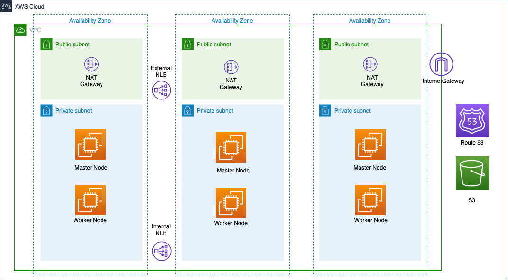

# AWS ROSA

### Architecture


### Installation
* Download `rosa` cli [here](https://github.com/openshift/rosa/releases)
* Get RedHat ROSA token [here](https://cloud.redhat.com/openshift/token/rosa)
* Enable ROSA [here](https://console.aws.amazon.com/rosa/home)
* Run the following steps:
```bash
## Configures your AWS account and ensures everything is setup correctly
$ rosa init

## Login
$ rosa login --token=<rosa_token>

## Starts the cluster creation process (~30-40minutes) and watches the logs
$ rosa create cluster --cluster-name <cluster_name> --watch --compute-machine-type "m5.4xlarge" --compute-nodes 3
```

### Configuring your IDP (GitHub Enterprise)
* Click Settings → Developer settings → OAuth Apps → Register a new OAuth application.
* Enter an application name.
* Enter Homepage URL e.g `https://oauth-openshift.apps.femi-rosa.z2ri.p1.openshiftapps.com`
* Optional: Enter an application description.
* Enter the authorization callback URL, where the end of the URL contains the identity provider name e.g `https://oauth-openshift.apps.femi-rosa.z2ri.p1.openshiftapps.com/oauth2callback/github/`
* Click Register application. GitHub provides a Client ID and a Client Secret. You need these values to complete the identity provider configuration.
* In your terminal, run `rosa describe cluster --cluster <cluster_name> | grep Details` to view the admin page of the cluster. Follow the link to the cluster and create OAuth using these generated information.
  * For the Hostname field enter the Enterprise hostname, e.g. github.ibm.com
* Grant admin priviledges to a user in the github org/team you provided through the admin page.

### Installing Portworx and CPD
* Login to the cluster using your IDP, generate a login command (top right corner) and get the token and server url. 
* Set the `openshift_api` and `openshift_token` variables with the server url and token respectively.
* Fill out the `variables.tf` in the root folder or create an `.tfvars` file for your variables.
* Deploy, using:
```bash
terraform apply
```