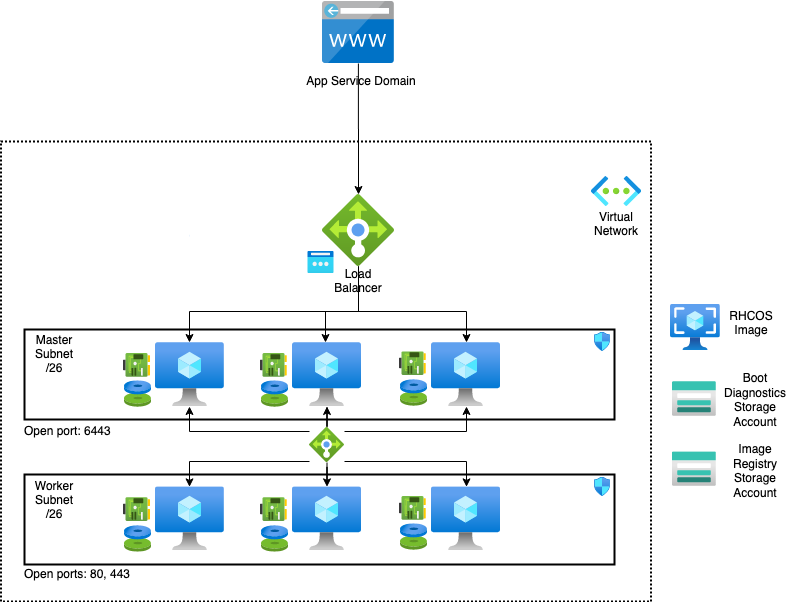

# Cloud Pak for Data 4.0 on Azure

## Deployment Topology

Deploying this template builds the following Cloud Pak for Data cluster in single zone or multi zone.



The template sets up the following:
- A highly available architecture that spans up to three Availability Zones.
- A Virtual network configured with public and private subnets.
- In a public subnet, a bastion host to allow inbound Secure Shell (SSH) access to compute instances in private subnets.
-	In the private subnets:
    * OpenShift Container Platform master instances.
    * OpenShift compute nodes with machine auto scaling features.
- An Azure Load Balancer spanning the public subnets for accessing Cloud Pak for Data from a web browser.
- Storage disks with Azure Managed Disk mounted on compute nodes for Portworx or OCS (OpenShift Container Storage) v4.5 or on an exclusive node for NFS.
- An Azure domain as your public Domain Name System (DNS) zone for resolving domain names of the IBM Cloud Pak for Data management console and applications deployed on the cluster.

### Prerequisites
* Install terraform using this [link](https://learn.hashicorp.com/tutorials/terraform/install-cli)
* Install `jq`
  ```bash
  wget https://github.com/stedolan/jq/releases/download/jq-1.6/jq-linux64
  mv jq-linux64 jq
  chmod +x jq
  mv jq /usr/local/bin
  ```
* Install `wget`, `htpasswd`, `python3` and [az-cli](https://docs.microsoft.com/en-us/cli/azure/install-azure-cli?view=azure-cli-latest) CLIs:
  * RHEL:
  ```bash
  yum install wget jq httpd-tools python36 -y
  ln -s /usr/bin/python3 /usr/bin/python
  ln -s /usr/bin/pip3 /usr/bin/pip
  pip install pyyaml
  ```
* Download Openshift CLI and move to `/usr/local/bin`:
```bash
wget wget https://mirror.openshift.com/pub/openshift-v4/clients/ocp/4.8.11/openshift-client-linux-4.8.11.tar.gz
tar -xvf openshift-client-linux-4.8.11.tar.gz
chmod u+x oc kubectl
sudo mv oc /usr/local/bin
sudo mv kubectl /usr/local/bin
oc version
```


### Steps to Deploy

* Create an [App Service Domain](https://portal.azure.com/#create/Microsoft.Domain).
  * This will also create a DNS Zone needed for this deployment.
  * Note the DNS Zone name.
* Create an Azure Service Principal with `Contributor` and `User Access Administrator` roles.
  * Create a Service Principal, using your Azure Subscription ID, named with a valid URL (e.g. http://john.doe.SP) and save the returned json:
    ```bash
    az login
    az ad sp create-for-rbac --role="Contributor" --name="<URL>" --scopes="/subscriptions/<subscription_id>"
    ```
  * Get an `Object ID`, using the AppId from the Service Principal just created:
    ```bash
    az ad sp list --filter "appId eq '<app_id>'"
    ```
  * Assign the `User Access Administrator` role, using the `Object Id`:
    ```bash
    az role assignment create --role "User Access Administrator" --assignee-object-id "<object_id>"
    ```
* [Download](https://cloud.redhat.com/openshift/install/pull-secret) a pull secret. Create a Red Hat account if you do not have one.

* [Sign up](https://www.ibm.com/account/reg/us-en/signup?formid=urx-42212) for a Cloud Pak for Data Trial Key if you don't have the entitlement API key.

* If you choose Portworx as your storage class, see [Portworx documentation](PORTWORX.md) for generating `portworx spec url`. 

* Read and agree to the [license terms](https://ibm.biz/BdffBz).

* Change to `azure_infra` folder:

* Check that the roles are correctly assigned by executing the script `./validate_azure_subscription.sh`.
* You can use the `wkc-1az-ocs-new-vnet.tfvars` file in this folder with preset values for a cluster with WKC enabled on OCS storage on a new VPC cluster. Note that the `<required>` parameters need to be set.
* You can also edit `variables.tf` and provide values for all the configuration variables. See the [Variables documentation](VARIABLES.md) for more details.

* Deploy scripts by executing the one of following commands

If using the variables.tf file

```bash
terraform init
terraform apply | tee terraform.log
```

OR 

if you are using the `wkc-1az-ocs-new-vnet.tfvars` file

```bash
terraform init
terraform apply -var-file=wkc-1az-ocs-new-vnet.tfvars | tee terraform.log
```

### Deploying to an existing network
* The existing network and the new cluster must be deployed to the same region.
* The existing network must have separate subnets for the master, worker, and if nfs storage is chosen, nfs subnet.

### Note:
* For a Private Cluster deployment, you need to deploy from a machine that will be able to connect to the cluster network. This means either from the same network or from a peered network.

### Destroying the cluster

* When cluster created successfully, execute following commands to delete the cluster:
  ```bash
  terraform destroy
  ```
* If cluster creation fails, execute following commands to delete the created resources:
  ```bash
  cd installer-files && ./openshift-install destroy cluster
  terraform destroy -var-file="<Path To terraform.tfvars file>"
  ```

